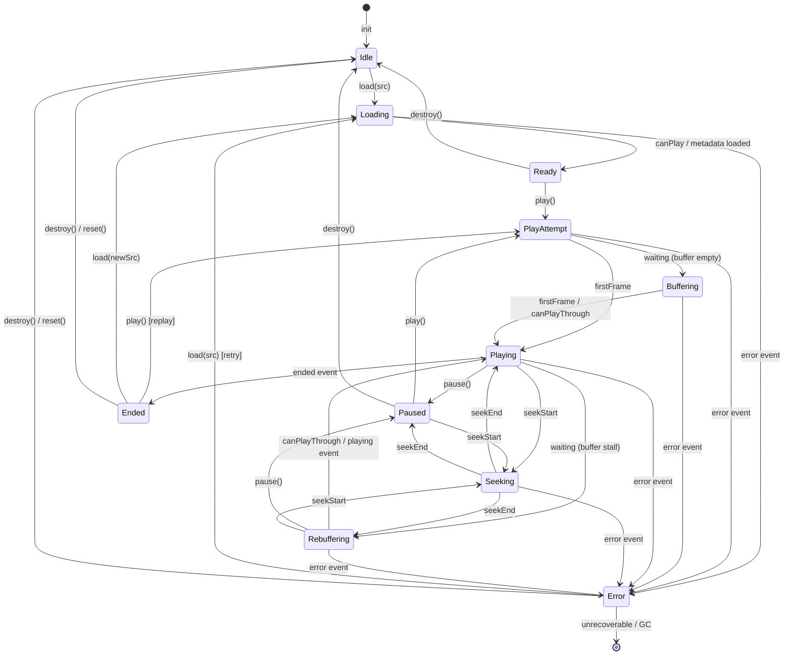

We are building an SDK framework and client SDKs that will measure Video Quality of Experience in native and web applications. It will collect data such as: Video Startup Time, Watch Time, Buffering, quality levels, and errors.

A major challenge with this type of add-in component is the labor it takes to support SDKs on the many different platforms: iOS, Android, Apple TV, Android TV, React Native, Hls.js, Shaka, Video.js, Bitmovin (multiple platforms), THEOPlayer (multiple platforms), Roku. The work to create the SDKs and player integrations across all these platforms is high and is an on-going cost that must be paid by maintainers.

This project is not a full product, it is meant as a proof of concept to prove out the architecture, demonstrate value to implementors, and allow for customer-specified backends. 

## Goals

The initial goal is to prove out the architecture and viability of this integration method. The project will not have a fully functional backend or all the metrics collected yet but it may in the future.    

## Personas

The most common user is a developer who is implementing an SDK to collect video playback information and quality of experience. The developer is sometimes a front-end expert but usually not a video expert. The developer experience should focus on ease of use while being flexible to support different integration methods.

A smaller number of users will implement the player-specific integration for custom or new players. These developers will be more experienced building applications with video players or building the players themselves. This is less common but still important to support with a robust developer experience.

## High-level Architecture:

In order to minimize the amount of work to support the SDK across many platforms, that use different runtimes and languages, the project will be architected in the following way:

* Cross-platform component. A base component that will contain the general QoE tracking and management logic. It will manage responsibilitiies such as:
  - Tracking events for the state machine of the current state of the player
  - Event processing logic for deduping, understanding events, etc.
  - Submitting the events and playback updates to an HTTP endpoint
  - Compression of the HTTP payload
* Platform-specific framework. A framework that will provide platform-specific integrations.
  - Specifies the platform integration points such as functions to call HTTP enpoints, platform timers, etc.
* Player-specfic integration per platform. Integrates the specific player APIs on a platform (e.g. Hls.js on HTML5/Javascript) to collect the actual Quality of Experience data.
  - Player Scrubber postion
  - Integration with Player APIs for QoE data and player state

## Languages:

The Cross-platform component will be written in Rust and cross-compiled for platforms in the appropriate methods. It will use Web Assembly (wasm) for the web; native interop for iOS, Android, and other native platforms. 

The Platform-specific frameworks will be written in the platform native language. Swift for iOS and MacOS, Kotlin for Android, JavaScript for JavaScript-native platforms such as HTML5/web and other HTML5/JavaScript-based platforms.

The Player-specific integrations will be writter in the platform-specific framework language the player is using. 

## Developer Experience:

Developers integrating a Player-specific SDK into their player will interact with the player-specific SDK. The player-specific SDK will hide the cross-platform base component and the platform-specific SDK that were used to implment the player-specific SDK.

### Player-specific SDK API actions:
* Initialize the SDK: take the player instance, player component, and video metadata object as parameter
* Update metadata: take the video metadata collection as a parameter
* Destroy the SDK instance

## Monitored Data:

### The following events will be collect from the player/user agent when they occur:
* Play
* Pause
* End
* Rebuffer start/end
* First Frame

### The following data will be collected:
* Video Start Time (the amount of time from play attempted to the first frame being shown)
* Rebuffer Time (the amount of time spent waiting while video buffers while playing)
* Watched Time (the amount of time spent attempting to watch video: inclusive of video start time, playing, rebuffering time, etc.)
* Played Time (the amount of time spent watching video that is playing, does not include rebuffering, paused, seeking time)
* Errors

### Video Metadata:
* User Agent
* Video Title
* Video ID

### SDK Metadata:
* Base component name and version
* Framework name and version
* Player SDK name and version
* API version

## Player State Machine

## Beacon Communication

HTTP Beacons will be sent when a playback event occurs:
* Play
* Stop
* Seek
* First Frame (at start of video session)
* Rebuffer
* Quality Change (audio or video)

Heartbeat events will also be sent on an recurring interval while the video is not stopped. The heartbeats will contain aggregated metrics and the playback state at the hearbeat time.

### HTTP Beacon Payload Schema

The HTTP beacon payload should provide an efficient and reasonable compression of data (deduplication and minization, where possible). Ability to read the data payload manually, for example as a JSON object, is useful but not required. 

Every HTTP beacon that is sent, in addition to the data, will have:
* Reliable timestamp from the client
* Sequence number of the beacon which is a sequentially increasing integer during the session, starting at 0
* A play id that set at the start of the play session for the specific video being watched

### HTTP Authentication model

In order to authenticate submission to the HTTP enpoint, the user will include a "project" key that was generated by the server. The project key is a unique identifier for the developer's project where the data will be collect, starting with "p", that is 10 alphanumberic characters long. For now, this can be hardcoded to the value "p123456789". 

### HTTP Endpoint

Beacons will use HTTP POST calls and will include the beacon payload in the POST body.

The HTTP endpoint will be configured in the base component by default or can be overridden by a setting in the SDK. By default, use the value: http://localhost:3000/beacon.

## Goals

This is an add-on SDK for internet video, so performance is critical. It is extremely important that:
* There is not an impact the viewers experience due to SDK processing
* The SDK needs to be as small as possible to reduce impact on download size of the application
* Impact on the page/view load time of the application due to including the SDK should be minimized 
* Beacon submissions should be small and efficient